# KayakClone AI Agent

AI Recommendation Service for a distributed travel metasearch platform, built as part of **DATA 236: Distributed Systems** at San Jose State University (Fall 2025).

> **My contribution** in a 6-person team project — I designed and implemented the entire `ai/` service independently, including the Concierge Agent, Deals Agent, semantic cache, WebSocket notifications, AI frontend tab, and Kafka integration. The full platform repository is at [zohebwaghu/Kayak---DATA-236-Final-Project](https://github.com/zohebwaghu/Kayak---DATA-236-Final-Project).

---

## System Overview

The AI service runs as a standalone FastAPI microservice (`kayak-ai-service`, port 8000) within a 14-container Docker stack, integrated with Kafka for event streaming and Redis for semantic caching.

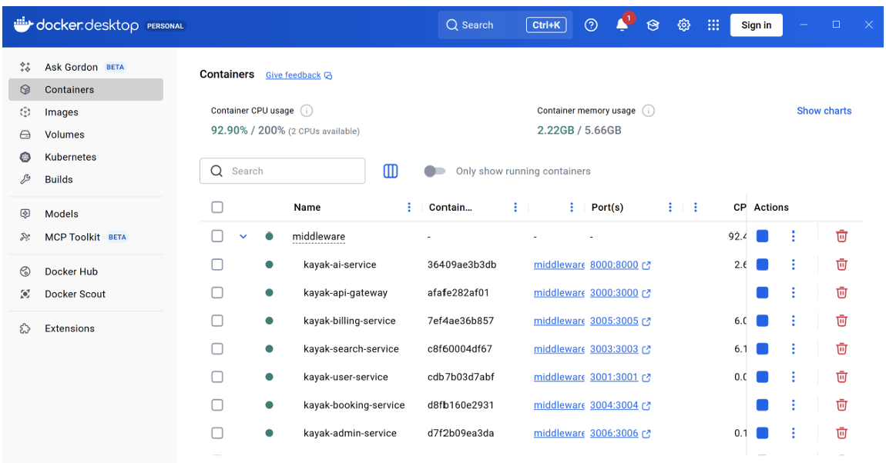
*All 14 services running in Docker, including kayak-ai-service on port 8000*

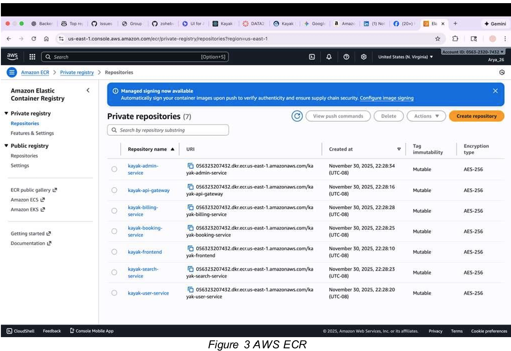
*7 containerized services pushed to Amazon ECR for production deployment*

---

## What I Built

### 1. Concierge Agent — MRKL Architecture (`agents/concierge_agent.py`)

A conversational travel planning agent where the LLM parses intent, then routes to one of **6 specialized tools** rather than handling everything in a single prompt. Supports multi-turn sessions via `ConciergeAgentWrapper`, maintaining per-user agent instances keyed by `session_id`.

| Tool | Trigger keywords | What it does |
|------|-----------------|--------------|
| `search_bundles` | "find", "search", "trip" | Queries SQLite for flight + hotel packages, calculates Fit Score |
| `price_analyzer` | "good deal", "worth it" | Compares current price to 30-day average, returns buy/wait verdict |
| `watch_creator` | "watch", "alert", "notify" | Stores threshold in Redis + SQLite, triggers WebSocket push |
| `quote_generator` | "quote", "full price" | Produces fare class, baggage allowance, taxes, cancellation terms |
| `policy_lookup` | "cancel", "pet", "baggage" | Retrieves policy snippets from SQLite |
| `booking_confirmer` | "book it", "confirm" | Creates `BookingRecord`, returns reference e.g. `BK93509D51` |

### 2. Deals Agent — Kafka Pipeline (`agents/deals_agent_runner.py`)

Background worker consuming and producing Kafka events through a 4-stage pipeline:

```
raw_supplier_feeds → deals.normalized → deals.scored → deals.tagged
```

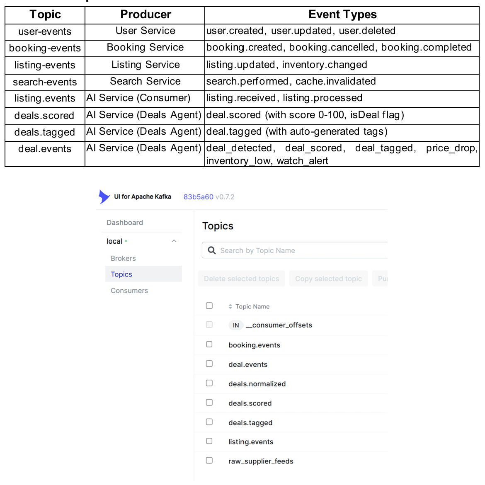
*Kafka topics showing AI Service as both consumer (listing.events) and producer (deals.scored, deals.tagged, deal.events)*

### 3. Deal Scoring Algorithm (`algorithms/deal_scorer.py`)

5-component scoring system, capped at 100:

| Component | Max pts | Logic |
|-----------|---------|-------|
| Price advantage | 40 | ≥30% below 30d avg → 40pts; ≥20% → 30pts; ≥15% → 20pts |
| Scarcity | 30 | 1 left → 30pts; 2 left → 25pts; 3–5 → 15pts |
| Rating bonus | 20 | ≥4.8 → 20pts; ≥4.5 → 15pts; ≥4.0 → 10pts |
| Promotion | 10 | Active promo flag → 10pts |
| Route reliability | 10 | On-time % from MongoDB (flights only) |

Deal threshold: **score ≥ 40**. Quality labels: Excellent (80+), Great (60–79), Good (40–59).

### 4. Fit Score (`algorithms/fit_scorer.py`)

Per-user bundle relevance scoring:

| Dimension | Max pts | Logic |
|-----------|---------|-------|
| Price vs budget | 30 | ≤70% of budget → 30pts; ≤90% → 20pts; at budget → 10pts |
| Amenity match | 25 | (matched / total preferences) × 25 |
| Location quality | 15 | Near transit → 10pts; unique neighbourhood → 5pts |
| Deal score bonus | 15 | avg deal score × 0.15 |
| Quality bonus | 10 | 4★+ hotel → 10pts; direct flight → 5pts |

### 5. Semantic Cache (`cache/semantic_cache.py`, `cache/embeddings.py`, `cache/redis_client.py`)

Avoids redundant LLM API calls by detecting semantically equivalent queries:
- Embeds each query with **OpenAI `text-embedding-3-small`**
- Stores `{embedding, intent, query}` JSON in Redis with key `semantic_cache:<hash>`
- Cache HIT when cosine similarity ≥ **0.85** → returns cached intent, skips LLM call
- TTL: **300 seconds** | Hit rate: **40%** | Speedup: **9×**

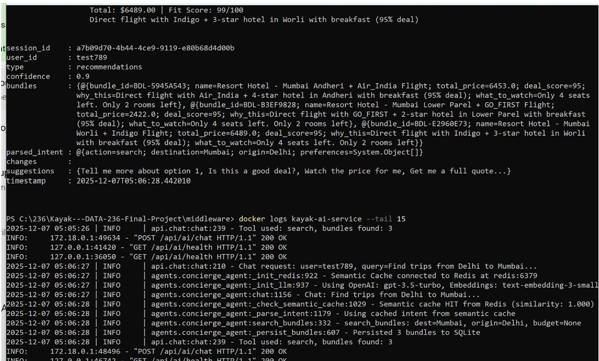
*Docker logs showing semantic cache HIT (similarity: 1.000) — cached intent reused, LLM call skipped*

### 6. AI Frontend Tab

Built the "AI Mode" tab integrated into the React frontend, providing a chat interface for all 5 user journeys.

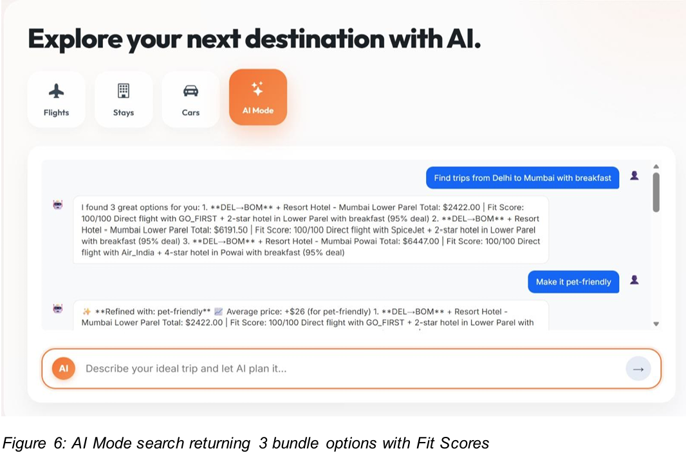
*AI Mode returning 3 bundle options with Fit Scores, "why this" and "what to watch" explanations*

### 7. WebSocket Notifications (`api/events_websocket.py`, `api/websocket.py`)

Real-time watch alerts pushed to connected clients when price/inventory thresholds trigger.

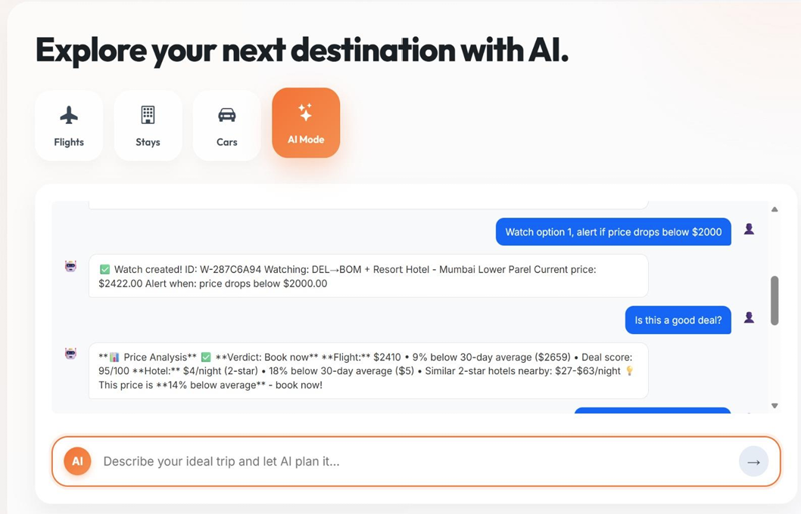
*watch_creator storing alert in Redis + SQLite; price_analyzer returning deal score 95/100, 14% below average*

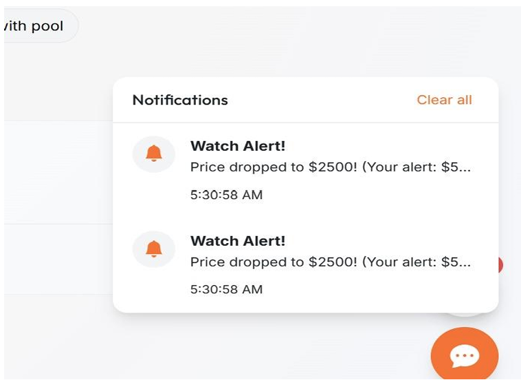
*Real-time "Watch Alert! Price dropped to $2500" notifications pushed via WebSocket*

### 8. AI Booking Integration

After the Concierge Agent confirms a booking, users are redirected to the booking review page showing the AI Travel Package label, itemized flight and hotel prices, and Continue to Payment button.

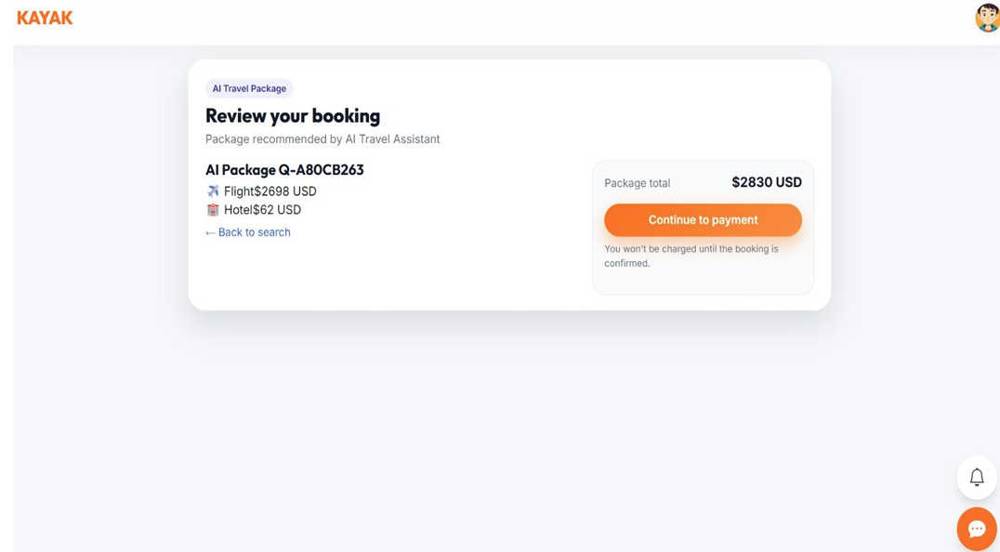
*AI Package booking page — recommended by AI Travel Assistant, redirects to payment flow*

---

## Five User Journeys

| # | Journey | Example query | Tool used |
|---|---------|--------------|-----------|
| 1 | Tell me what I should book | "Find trips from Delhi to Mumbai with breakfast" | `search_bundles` → 3 options (Best Value / Best Deal / Best Quality) |
| 2 | Refine without starting over | "Make it pet-friendly" | Intent merged with session context, `search_bundles` re-run |
| 3 | Keep an eye on it | "Watch option 1, alert if price drops below $2000" | `watch_creator` → Redis + SQLite, WebSocket push on trigger |
| 4 | Decide with confidence | "Is this a good deal?" | `price_analyzer` → % below 30d avg, deal score, buy/wait verdict |
| 5 | Book or hand off cleanly | "Get me a full quote" → "Book it" | `quote_generator` → `booking_confirmer` → redirect to checkout |

---

## Tech Stack

| Layer | Technology |
|-------|-----------|
| API framework | FastAPI (Python) |
| LLM | OpenAI GPT-3.5-turbo / Ollama (llama3.2, qwen2.5) / Gemini (AWS) |
| Embeddings | OpenAI `text-embedding-3-small` |
| Semantic cache | Redis — cosine similarity, TTL 300s |
| AI persistence | SQLite + SQLModel + Pydantic v2 |
| Message queue | Apache Kafka — consumer: `listing.events`; producer: `deals.scored`, `deals.tagged`, `deal.events` |
| Real-time | WebSocket — watch alerts and deal notifications |
| Containerization | Docker / AWS ECR |

---

## Project Structure

```
ai/
├── agents/
│   ├── concierge_agent.py      # MRKL Concierge Agent + ConciergeAgentWrapper
│   ├── deals_agent_runner.py   # Kafka-based Deals Agent background worker
│   ├── bundle_builder.py       # Flight + hotel bundle construction
│   ├── deal_scorer.py          # Deal scoring (agents copy)
│   └── ingest_csv.py           # CSV ingestion for Deals Agent
├── algorithms/
│   ├── deal_scorer.py          # 5-component deal scoring algorithm (0–100)
│   ├── fit_scorer.py           # Per-user Fit Score calculation
│   └── bundle_matcher.py       # Bundle search and ranking logic
├── api/
│   ├── chat.py                 # POST /api/ai/chat — main conversational endpoint
│   ├── bundles.py              # Bundle search endpoints
│   ├── quotes.py               # Quote generation endpoints
│   ├── watches.py              # Watch CRUD + Redis watch_store
│   ├── price_analysis.py       # Price analysis endpoints
│   ├── events_websocket.py     # WebSocket event push
│   ├── websocket.py            # WebSocket connection manager
│   └── ai_chat.py              # Legacy chat handler
├── cache/
│   ├── semantic_cache.py       # Cosine similarity cache logic (12 KB)
│   ├── embeddings.py           # OpenAI embedding wrapper (9 KB)
│   └── redis_client.py         # Redis connection (5 KB)
├── interfaces/
│   └── deals_cache.py          # In-memory deals cache interface
├── kafka_client/               # Kafka consumer/producer wrappers
├── llm/                        # LLM abstraction (OpenAI / Ollama / Gemini)
├── models/
│   ├── database.py             # SQLite engine + session + init_db()
│   ├── concierge_entities.py   # BundleRecord, QuoteRecord, BookingRecord, WatchRecord
│   └── deals_entities.py       # Airport, FlightDeal, HotelDeal (SQLModel tables)
├── schemas/                    # Pydantic v2 request/response schemas
├── utils/                      # Shared utilities
├── main.py                     # FastAPI app entry point (18 KB)
├── config.py                   # Environment configuration
├── import_data.py              # Kaggle dataset ingestion (25 KB)
├── test_integration.py         # Integration tests (14 KB)
├── test_kafka.py               # Kafka pipeline tests
├── requirements.txt
├── Dockerfile
├── .env.example
├── QUICK_START.md
└── START_AI_SERVICE.md
```

---

## Data Models (SQLModel + Pydantic v2)

**SQLite tables** (7 total):

| Table | Entity | Key fields |
|-------|--------|-----------|
| `airports` | `Airport` | `iata`, `city`, `latitude`, `longitude` |
| `flight_deals` | `FlightDeal` | `origin`, `destination`, `price`, `avg_30d_price`, `available_seats`, `deal_score` |
| `hotel_deals` | `HotelDeal` | `city`, `neighbourhood`, `price_per_night`, `avg_30d_price`, `near_transit`, `deal_score` |
| `bundles` | `BundleRecord` | `bundle_id`, `fit_score`, `deal_score`, `explanation_json` |
| `quotes` | `QuoteRecord` | `fare_class`, `baggage`, `cancellation_policy`, `grand_total` |
| `bookings_ai` | `BookingRecord` | `booking_reference`, `status` |
| `watches` | `WatchRecord` | `price_threshold`, `inventory_threshold`, `is_active`, `triggered` |

---

## Performance (100 Concurrent Users via Apache JMeter)

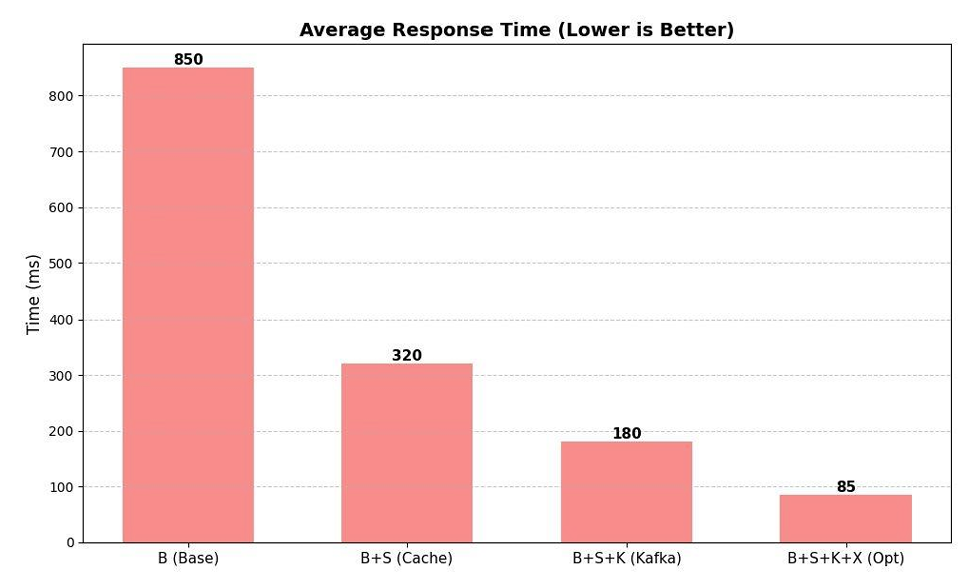
*90% latency reduction: 850ms → 85ms with Redis cache + Kafka + query optimization*

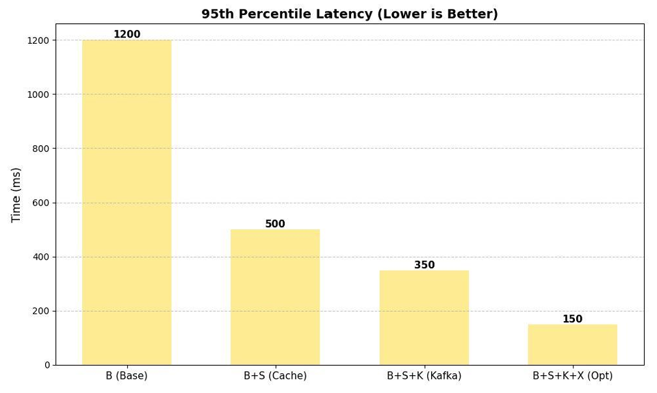
*p95 latency: 1200ms → 150ms fully optimized*

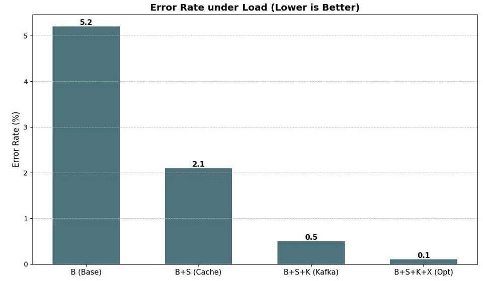
*Error rate: 5.2% → 0.1% with full optimization stack*

| Configuration | Avg Response | p95 Latency | Throughput | Error Rate |
|--------------|-------------|------------|-----------|-----------|
| Baseline | 850ms | 1200ms | 45 req/s | 5.2% |
| + Redis Cache | 320ms | 500ms | 120 req/s | 2.1% |
| + Kafka | 180ms | 350ms | 280 req/s | 0.5% |
| Fully Optimized | **85ms** | **150ms** | **450 req/s** | **0.1%** |

Semantic cache: **40% hit rate**, **9× speedup** on NLU query matching.

---

## Setup

```bash
# 1. Copy environment variables
cp .env.example .env
# Edit .env — add OPENAI_API_KEY, Redis/Kafka connection strings

# 2. Start all services (from project root)
cd middleware && docker-compose up -d

# 3. Import data into SQLite
docker exec -it kayak-ai-service python /app/import_data.py
# Expected: Airports: 6372 | Flights: 10000 | Hotels: 10000

# 4. Health check
curl http://localhost:8000/api/ai/health
```

**LLM options:**
- OpenAI (recommended): set `OPENAI_API_KEY` in `.env`
- Ollama (free/local): `ollama pull llama3.2 && ollama serve`, leave key empty

See `QUICK_START.md` and `START_AI_SERVICE.md` for full details.

---

## Related

- Full platform repo: [zohebwaghu/Kayak---DATA-236-Final-Project](https://github.com/zohebwaghu/Kayak---DATA-236-Final-Project)
- My GitHub: [SunnyJaneH](https://github.com/SunnyJaneH/KayakClone-AI-Agent)
